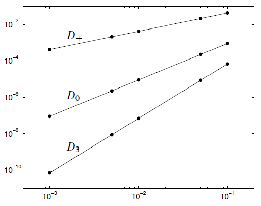

# FDM 基本概念

* 精度 

一种格式具有 $p$ 阶精度, 取决于该格式的误差 $E\propto h^p$, 其中 $h$ 是网格步长。

* 为什么误差随着$h$ 变化的图适合用 log-log scale 表述:

$$
E(h) \approx C h^p \\
\mathrm{lg} |E(h)| \approx \mathrm{lg} C + p\mathrm{lg} h
$$

于是, 误差和步长的关系在图中就是线性的。比如长这个样子 [^1]: 

# 参考文献
[^1]: Finite Difference Methods for Ordinary and Partial Differential Equations, Randall J. LeVeque, 2007